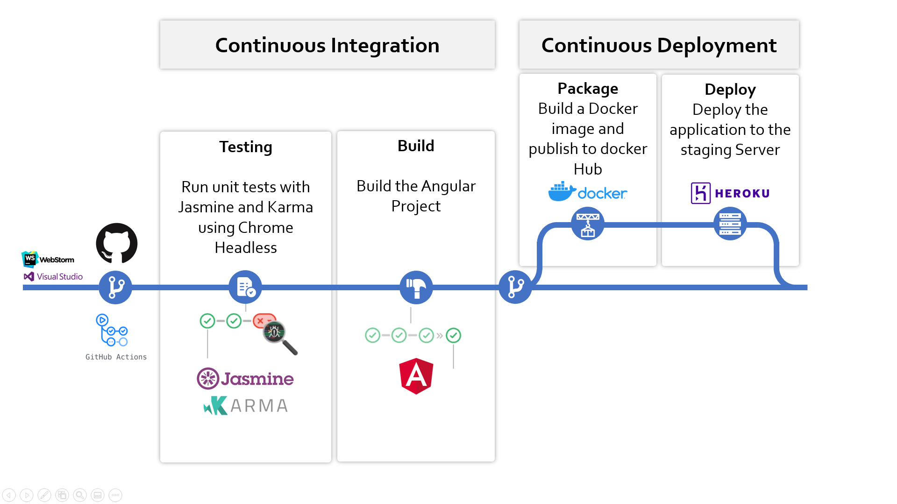

# Dev-Ops Final Assignment

This repository is the code used in our final assignment in DDOP SoSe20.

## DevOps Lifecycle

## Toolchain

#### Frameworks:
- Node.js
- NPM
- Webpack (js Module bundle)
- Angular 10

#### VC and Collaboration
- git
- GitHub
- docker
- DockerHub

#### Testing
- Jasmine
- Karma
- ChromeHeadless
- Heroku (staging server)

#### CI/CD 
- GitHub Actions
- elgohr/Publish-Docker-Github-Action
- Heroku Registry

## CI/CD Pipeline 

## Development server

Run `ng serve` for a dev server. Navigate to `http://localhost:4200/`. The app will automatically reload if you change any of the source files.

## Build

Run `ng build` to build the project. The build artifacts will be stored in the `dist/` directory. Use the `--prod` flag for a production build.

## Running unit tests

Run `ng test` to execute the unit tests via [Karma](https://karma-runner.github.io).

## Running end-to-end tests

Run `ng e2e` to execute the end-to-end tests via [Protractor](http://www.protractortest.org/).

## Build the docker file
docker build -t dev-ops-final-assignment-image .

## Create a container of the image
docker run --name dev-ops-final-assignment-container -d -p 8080:80 dev-ops-final-assignment-image

## Useful docker commands
| command | description  |
|---|---|
| docker image ls           | lists all docker images  |
| docker rmi {image id}     | deletes the image| 
| docker image prune        | deletes all unused images |
| docker container ls -a    |  lists all containers |
| docker container prune    | delete all stopped containers|

